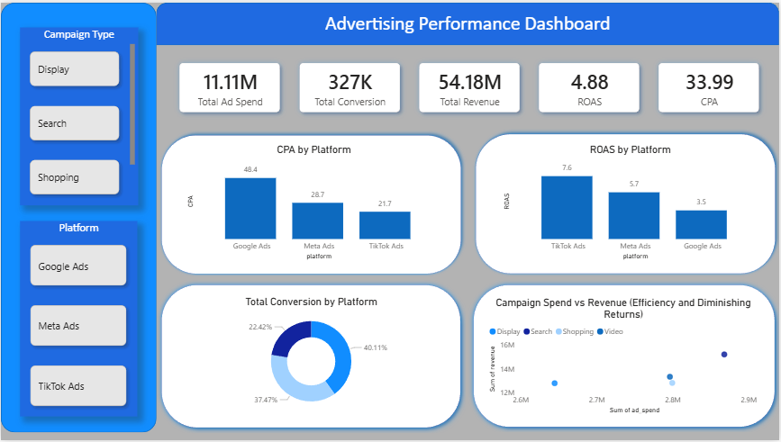

# 📊 Advertising Performance Analysis

## 🔎 Project Overview
This project analyses multi-platform digital advertising performance to identify opportunities for improving marketing efficiency and return on ad spend (ROAS).

The objective was to answer:

> **How can advertising budget be reallocated to maximise ROAS while maintaining acceptable CPA levels?**

The analysis was conducted using an end-to-end workflow:
**PostgreSQL → Python → Power BI**

---

## 🛠 Tools Used
- **PostgreSQL** – Data validation & KPI aggregation  
- **Python (Pandas, Matplotlib)** – Exploratory Data Analysis  
- **Power BI** – Executive dashboard & data storytelling  

---

## 📐 Key Metrics
- **ROAS (Return on Ad Spend)** = Revenue / Ad Spend  
- **CPA (Cost per Acquisition)** = Ad Spend / Conversions  
- **Conversion Share** = Platform contribution to total conversions  

All ratio metrics were calculated using aggregated totals to ensure accurate business interpretation.

---

## 📊 Key Insights

### ✅ TikTok Ads
- Highest ROAS  
- Lowest CPA  
- Strong scalability and efficiency  

### ⚠️ Google Ads
- High share of conversions  
- Highest CPA  
- Lower ROAS, indicating diminishing returns at higher spend  

### ➖ Meta Ads
- Moderate performance across CPA and ROAS  

> High conversion volume does not always imply high efficiency.

---

## 📈 Business Recommendation
- Maintain Google Ads for baseline demand.
- Reallocate incremental budget toward TikTok Ads to improve overall efficiency.
- Optimise underperforming Google campaigns to reduce diminishing returns.

### Expected Impact
- Lower average CPA  
- Improved marketing efficiency  
- Higher revenue growth without increasing total ad spend  

---

## 🚀 What This Project Demonstrates
- End-to-end analytics pipeline
- Proper handling of ratio metrics
- Ability to distinguish between volume and efficiency trade-offs
- Business-focused data storytelling
---
## 📊 Dashboard Preview

